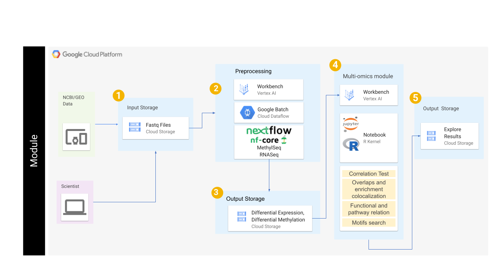

## Contents

+ [Getting Started](#getting-started)
+ [Workflow Diagram](#workflow-diagrams)

## Getting Started

### *Setting-up the Environment*

UND multi-omics repository contains three main folders representing each submodule. Every folder has its accompanying Jupyter notebook, if applicable. To start with this tutorial, you will need to set up your Google Cloud Platform, Vertex AI, and Jupyter notebook instance. 

#### *Creating a notebook instances* 

Follow the steps highlighted [here](https://github.com/NIGMS/NIGMS-Sandbox/blob/main/docs/HowToCreateVertexAINotebooks.md) to create a notebook instance in Vertex AI. Follow steps 1-8 and be especially careful to enable idle shutdown as highlighted in step 8. In step 7 in the Machine type tab, select n1-standard-8 from the dropdown box.

To clone this repository, use the Git command `git clone https://github.com/NIGMS/Integrating-Multi-Omics-Datasets.git` in the dropdown menu option in Jupyter notebook. Please make sure you only enter the link for the repository that you want to clone. There are other bioinformatics related learning modules available in the [NIGMS Repository](https://github.com/NIGMS). Before starting this module, it is recommended to go through basic RNA-seq and Methylation analysis modules. Below is a screenshot of `GoogleCloud` directory of this repository when cloned in Jupyter notebook using Git.

#### Optional: *Creating a Nextflow Service Account*
If you are using Nextflow outside of NIH CloudLab you must set up a service account and add your service account to your notebook permissions before creating the notebook. Follow section 2 of the accompanying [How To document](https://github.com/NIGMS/NIGMS-Sandbox/blob/main/docs/HowToCreateNextflowServiceAccount.md) for instructions. If you are executing this tutorial with an NIH CloudLab account your default Compute Engine service account will have all required IAM roles to run the nextflow portion.

### *Running the Modules*

The cloned repository has three folders for each submodule called RNA-Seq, RRBS, and Integration. All notebooks inside these submodules are designed to run in an R kernel. *To create a custom R kernel for each notebook, first select a Python kernel. Then, run the first cell in each notebook to initiate the R kernel creation process*. It is highly recommended to start with the RNA-Seq submodule, followed by RRBS, and finally, Integration. All the submodule folders consist of one .ipynb Jupyter notebook and accompanying files required for the analysis.

The initial cells of the notebook for RNA-Seq and RRBS submodules contain data pre-processing commands, which are done through Nextflow. Please follow other modules like [Transcriptome-Assembly-Refinement-and-Applications](https://github.com/NIGMS/Transcriptome-Assembly-Refinement-and-Applications) or [Nextflow nf-core/rnaseq](https://nf-co.re/rnaseq) for learning pre-processing through Nextflow. If Nextflow is installed correctly, the Jupyter notebook should be able to launch Nextflow and perform all the pre-processing by just running the cell and without requiring any further user input. If the command output of Nextflow is not displayed concisely, you can copy the command inside the quotes ("~/nextflow run ....") and execute it in a terminal window. Please make sure your path in the command is correct. Notebook cells with Nextflow commands will take longer to execute as they perform multiple computationally heavy tasks. RNA-seq and Bisulfite sequencing have dedicated tutorials where the analysis is explained in more detail. It is recommended to refer to those tutorials first, as this tutorial's primary focus is on integrating transcriptomic and epigenetic data. 

For RNA-Seq and Bisulfite sequencing data, further pre-processing and normalization is performed using R packages. The list of all the packages and versions is provided below under software requirements. Differential analysis, enrichment analysis, and visualization are performed in the same notebook. Further explanation of the code is provided in the markdown cells of the notebook. The Integration submodule uses the processed data results from RNA-seq and RRBS submodules to incorporate the datasets further and provide a better understanding of the experiment.

Now, you can explore the tutorial and run code blocks from each Jupyter notebook from top to bottom. If you are new to Jupyter notebooks, please follow the documentation or look for tutorials online. 

## **Workflow Diagrams**

As seen in the above figure, we have downloaded the data from the NCBI GEO website with accession number GSE173380. Sample data is already provided in the `gs://nigms-sandbox/nosi-und` Google Cloud bucket. There is no need to download the data again unless you want to run the optional Nextflow preprocessing step on the entire dataset (which could be computationally expensive). In the second step of submodule 1 and 2, Nextflow, in collaboration with Google Batch API and Vertex AI, is used to perform the preprocessing. Nextflow works as a workflow manager, which enables scalable and reproducible scientific workflows using containers. Google Life Sciences API is a suite of tools and services for managing, processing, and transforming life science data where it creates and manages clusters and virtual machines. It helps to split the job into multiple jobs and assigns each job to a set of designated virtual machines. Vertex AI, on the other hand, behaves like an interface to manage and execute the process. 

After initial preprocessing using Nextflow, further preprocessing, normalization, clustering analysis, differential analysis, and visualization is done in Vertex AI's Jupyter notebook using the R kernel. The results are written in the current working directory inside the Vertex AI instance and transferred to cloud buckets for storage. In the fourth step, we will extract the data from step two and three to use for the multi-omics module's integration analysis. The integrative analysis is also performed using Vertex AI's Jupyter notebook using the R kernel. We will use multi-omics integrative techniques like correlation tests, overlaps and enrichment colocalization, functional and pathway relation, and motifs search. The results from these techniques will be explored in the notebook and then transferred to cloud storage for future reference.   