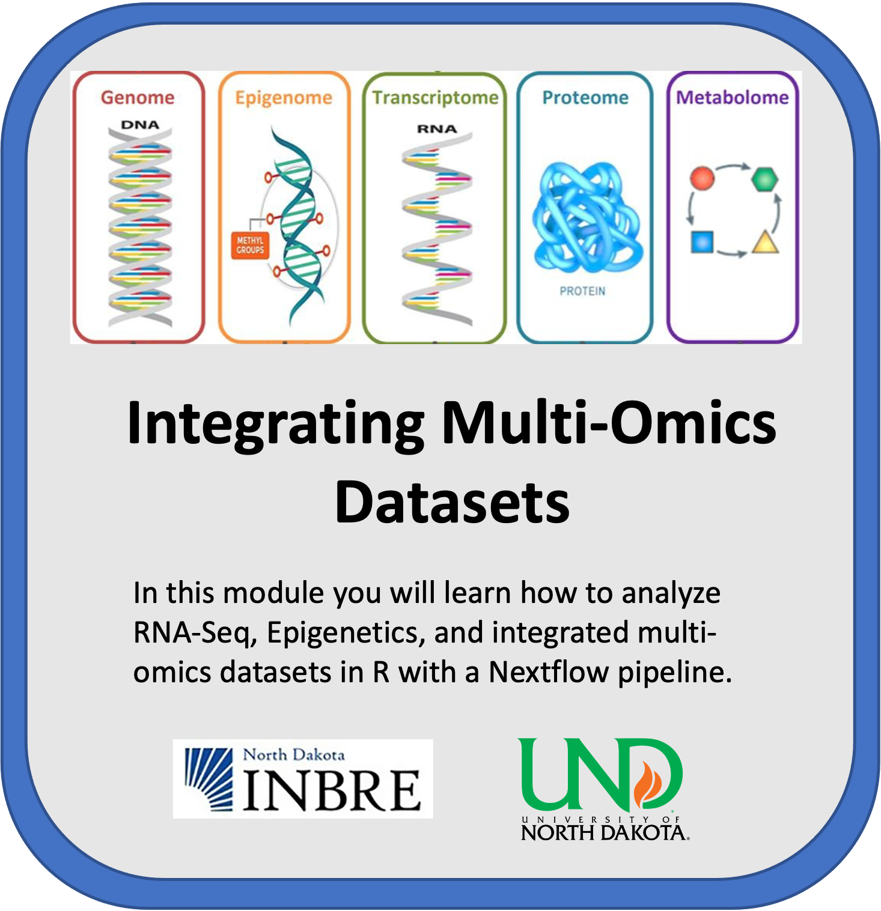

# Transcriptomic and Epigenetics Data Integration Module
## University of North Dakota
 

    

Image adapted from https://doi.org/10.1016/j.jbi.2020.103466

## **Contents**

+ [Introduction](#introduction)
+ [Learning Objectives](#learning-objectives)
+ [Overview](#overview)
+ [Software Requirements](#software-requirements)
+ [Dataset](#dataset)
+ [Funding](#funding)
+ [References](#references)

## **Introduction**

Watch this [Introduction Video](https://youtu.be/6c4C7KZxqZs) to learn more about the module.

This module will walk you through some of the techniques to integrate transcriptomic and epigenetic data. We will use RNA-seq and Reduced-Representation Bisulfite Sequencing (RRBS) for this tutorial. The raw sequencing data is downloaded from the NCBI GEO website (Accession: GSE173380) and stored in Google Cloud and Amazon S3 buckets. Data processing could be performed using Nextflow pipelines to generate read counts from the raw sequencing data, or the read count table can be directly imported from GEO. Further downstream analysis is performed in a Jupyter notebook instance with an R kernel. All the results are then pushed back to Google Cloud or Amazon S3 buckets for storage.

Next, watch [this video](https://youtu.be/3wwVNDOEQl0) to learn more about the module.

The training compromises of three submodules: RNA-seq, RRBS, and Integration, although the main focus will be on the Integration submodule. The RNA-seq and RRBS submodules focus on essential data preprocessing and differential analysis, while the Integration submodule expands on some techniques to integrate transcriptomic and epigenetic data. If you are a beginner, we recommend going through each submodule and also referring to other modules specific to RNA-seq and Bisulfite data analysis before starting with this module.

This module will cost you about $4.00 to run end to end, assuming you shutdown and delete all resources upon completion.

## **Learning Objectives**

These submodules were developed to be used on cloud platforms. These submodules were made using the Google Cloud Platform (GCP) and Amazon Web Services (AWS). The initial steps to create a virtual machine instance may vary depending on the cloud service used. Following are some of the skills you can gain through this tutorial and some prerequisites to follow along with these submodules. 

Skills you will gain:
1. Statistics
2. Genomic Technologies
3. Data Analysis
4. Cloud Computing
5. Bioinformatics
6. Multi-omics Approach
7. Data Visualization

Prerequisites - This course requires basic knowledge of the following:
1. Basic command line operations
2. R programming
3. Basic statistics and mathematics
4. Basic understanding of different omic technologies and online databases 
5. Basic Knowledge of Cloud Computing Environment

## **Overview** 

Although the main focus of this tutorial is the integration of transcriptomic and epigenetic data, it also teaches how to run standard RNA-seq and Bisulfite sequencing (RRBS) workflows in the cloud. It is recommended to run the modules in the following order.

**Module 1: RNA-Sequencing (Transcriptomic)**, often referred to as RNA-seq, is a sequencing technique that uses next-generation sequencing to find the identity and quantity of RNA from a biological sample. The identification of RNA within a sample gives insight into transcribed genes. At the basic level, RNA sequences are first generated by isolating RNAs from the biological sample, generating a complementary DNA library, and sequencing and aligning the reads. The generated reads then go through downstream analysis to reveal insights into the transcriptome, such as gene expression levels. RNA-seq has a few advantages over microarrays, another technique that provides information about gene expression. One advantage is the size of the biological sample needed. Microarrays need a microgram quantity of biological sample, whereas RNA-Seq only requires a biological sample on the nanogram level. Further, RNA-Seq can provide a greater magnitude of gene expression information compared to microarray.

**Module 2: Bisulfite Sequencing (Epigenetic)** is a very well-established protocol used to analyze methylated cytosines in genomic DNA. Bisulfite sequencing is primarily used to detect DNA methylation patterns, and it offers a quantitative and efficient approach to identify the 5-methylcytosine at a single base pair resolution. The main procedure to analyze the DNA methylation status is by comparing the sequencing results to the original DNA sequence. 5-methylcytosine (5mC) is present in the genome when a C-peak is present because all unmethylated cytosines (C) transform to thymine (T). If both the C- and T-peaks are present, partial methylation or possibly insufficient bisulfite conversion has occurred. After the bisulfite conversion, the next step is to perform PCR amplification before the interpretation of the sequencing data. 

**Module 3: Integration of RNA-seq and Reduced-Representation Bisulfite Sequencing Data** is illustrated in the integration module. Four techniques, namely correlation test, overlaps and enrichment colocalization, functional and pathway relations, and motifs search, are used to interpret both data sets collectively. Normalized expression, Differential expression, per-base methylation levels, differentially methylated positions, and differentially methylated regions from both RNA-seq and Bisulfite sequencing submodules are used as the input data for the integration analysis. The final results are explored in the Jupyter notebook itself and then stored in cloud storage. The integration workflow is also explained in the following figure. 

## **Software Requirements**

The R (version 4.3.3) package information is located in a bash script file associated with each submodule, reflecting the state at the time of tutorial development.

## **Dataset**

The dataset for this tutorial is extracted from GEO website accession number GSE173380 [1]. This dataset is publicly available on the GEO website. For initial pre-processing using Nextflow, only a sample of this data is used to speed up the processing and reduce heavy computation. For sampling, only two files/runs are used for RNA-Seq and bisulfite sequencing, which are pulled from cloud storage buckets. After demonstrating the initial pre-processing steps with a sample dataset, we use the gene expression and methylation files available under the same accession from the supplementary file section at GEO. These files are provided in the repository and are used for further downstream analysis.

## **Funding**

National Institute Of General Medical Sciences of the National Institutes of Health under Award Number P20GM103442

## **References**

[1]. Chen Z, Wang C, Blood A, Bragg S et al. Renal functional, transcriptome, and methylome adaptations in pregnant Sprague Dawley and Brown Norway rats. PLoS One 2022;17(6):e0269792. PMID: 35709218 - [Dataset: GSE173380]

[2]. Singhal SK, Usmani N, Michiels S, Metzger-Filho O, Saini KS, Kovalchuk O, Parliament M. Towards understanding the breast cancer epigenome: a comparison of genome-wide DNA methylation and gene expression data. Oncotarget. 2016 Jan 19;7(3):3002-17. doi: 10.18632/oncotarget.6503. PMID: 26657508; PMCID: PMC4823086.

## **License for Data**

Text and materials are licensed under a Creative Commons CC-BY-NC-SA license. The license allows you to copy, remix and redistribute any of our publicly available materials, under the condition that you attribute the work (details in the license) and do not make profits from it. More information is available [here](https://tilburgsciencehub.com/about).

This work is licensed under a [Creative Commons Attribution-NonCommercial-ShareAlike 4.0 International License](http://creativecommons.org/licenses/by-nc-sa/4.0/)
