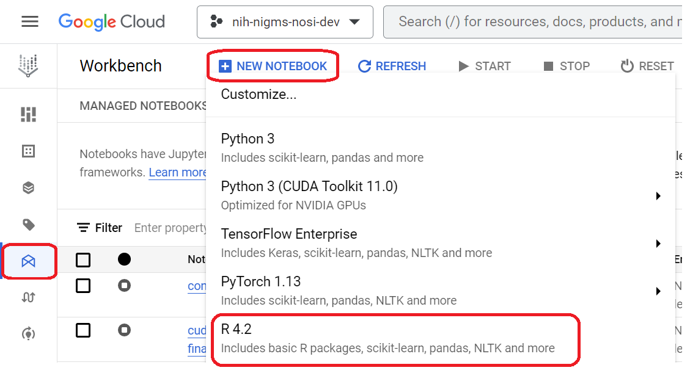
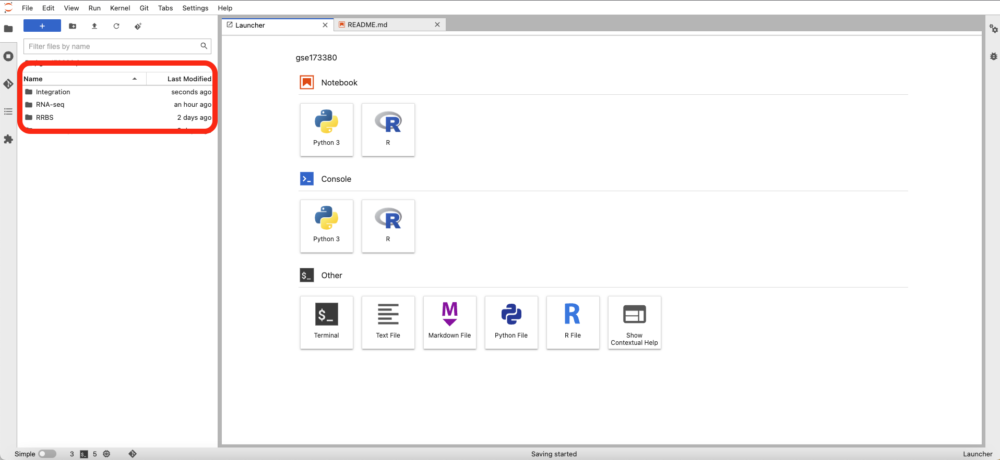
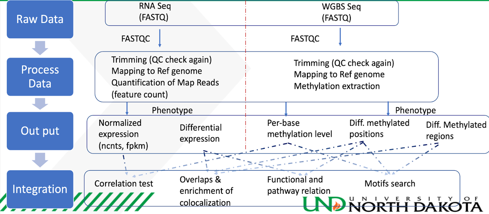
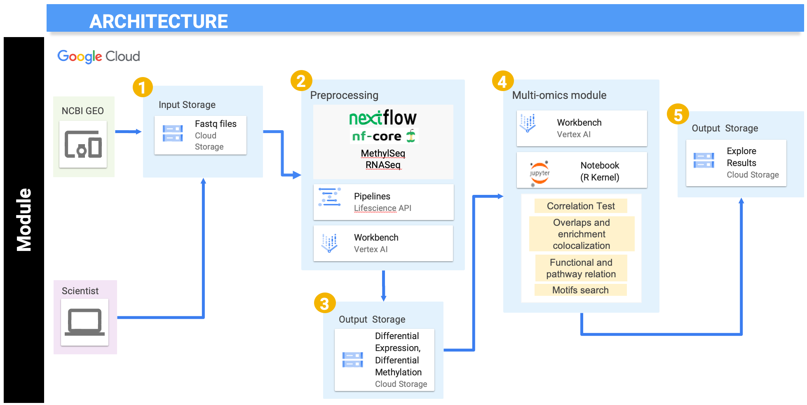

<!-- #region -->
# University of North Dakota: Transcriptomic and Epigenetics Data Integration Module. 
---------------------------------
Watch this [Introduction Video](https://youtu.be/6c4C7KZxqZs) to learn more about the module.

This module will walk you through some of the techniques to integrate transcriptomic and epigenetic data. We will use RNA-seq and Reduced-Representation Bisulfite Sequencing (RRBS) for this tutorial. The raw sequencing data is downloaded from the NCBI GEO website (Accession: GSE173380) and stored in Google Cloud buckets. Data processing could be performed using Nextflow pipelines to generate read counts from the raw sequencing data, or the read count table can be directly imported from GEO. Further downstream analysis is performed in Vertex AI's Jupyter notebook instance with R kernel. All the results are then pushed back to Google Cloud buckets for storage.

Next, watch [this video](https://youtu.be/3wwVNDOEQl0) to learn more about the module.

The training compromises of three submodules: RNA-seq, RRBS, and Integration, although the main focus will be on the Integration submodule. The RNA-seq and RRBS submodules focus on essential data preprocessing and differential analysis, while the Integration submodule expands on some techniques to integrate transcriptomic and epigenetic data. If you are a beginner, we recommend going through each submodule and also referring to other modules specific to RNA-seq and Bisulfite data analysis before starting with this module.

This module will cost you about $3.20 to run end to end, assuming you shutdown and delete all resources upon completion.

## Overview of Page Contents

+ [Getting Started](#GS)
+ [Overview](#OV)
+ [Software Requirements](#SOF)
+ [Workflow Diagram](#WORK)
+ [Dataset](#DATA)
+ [Troubleshooting](#TR)
+ [Funding](#FUND)
+ [References](#REF)

## **Getting Started** <a name="GS"></a>

These submodules were developed to be used on cloud platforms. Although these submodules were made using the Google Cloud Platform, the Jupyter notebooks should work on other cloud services like Amazon AWS and Microsoft Azure with some minor changes in data storage and handling. The initial steps to create a virtual machine instance may vary depending on the cloud service used. Following are some of the skills you can gain through this tutorial and some prerequisites to follow along with these submodules. 

Skills you will gain:
1. Statistics
2. Genomic Technologies
3. Data Analysis
4. Cloud Computing
5. Bioinformatics
6. Multi-omics Approach
7. Data Visualization

Prerequisites - This course requires basic knowledge of the following:
1. Basic command line operations
2. R programming
3. Basic statistics and mathematics
4. Basic understanding of different omic technologies and online databases 
5. Basic Knowledge of Cloud Computing Environment

### *Setting-up the Environment*

UND multi-omics repository contains three main folders representing each submodule. Every folder has its accompanying Jupyter notebook, if applicable. To start with this tutorial, you will need to set up your Google Cloud Platform, Vertex AI, and Jupyter notebook instance. Please begin by navigating to the [NIH Cloud Lab README](https://github.com/STRIDES/NIHCloudLabGCP). This will walk you through the basics of cloud platforms and provide links for setting up the environment. Once you have set up your Google Cloud account, please refer to images below to set up a Jupyter notebook instance under Vertex AI. Follow the steps and clone this repository using the Git command `git cp https://github.com/NIGMS/MultiomicsUND` dropdown menu option in Jupyter notebook. Please make sure you only enter the link for the repository that you want to clone. There are other bioinformatics related learning modules available in the [NIGMS Repository](https://github.com/NIGMS). Before starting this module, it is recommended to go through basic RNA-seq and Methylation analysis modules. Following is an example of this current repository when cloned in Jupyter notebook using Git.

#### Optional: *Creating a Nextflow Service Account*
If you are using Nextflow outside of NIH CloudLab you must set up a service account and add your service account to your notebook permissions before creating the notebook. Follow section 2 of the accompanying [How To document](https://github.com/NIGMS/NIGMS-Sandbox/blob/main/docs/HowToCreateNextflowServiceAccount.md) for instructions. If you are executing this tutorial with an NIH CloudLab account your default Compute Engine service account will have all required IAM roles to run the nextflow portion.

#### *Creating a user managed notebook* 
From the console, select VertexAI Workbench --> New User Managed Notebook --> R4.2.


This module uses a machineType of n1-standard-8. Make sure to select advanced options --> machineType n1-standard-8 when creating your notebook. 

#### *Cloned repository structure*



### *Running the Modules*

The cloned repository has three folders for each submodule called RNA-Seq, RRBS, and Integration. All notebooks inside these submodules are designed to run in the R kernel. Please check that the right top of the notebook says R and not Python 3. It is highly recommended to start with the RNA-Seq submodule, followed by RRBS, and finally, Integration. All the submodule folders consist of one .ipynb Jupyter notebook and accompanying files required for the analysis.

The initial cells of the notebook for RNA-Seq and RRBS submodules contain data pre-processing commands, which are done through Nextflow. Please follow other modules like [rnaAssemblyMDI](https://github.com/NIGMS/rnaAssemblyMDI) or [Nextflow nf-core/rnaseq](https://nf-co.re/rnaseq) for learning pre-processing through Nextflow. If Nextflow is installed correctly, the Jupyter notebook should be able to launch Nextflow and perform all the pre-processing by just running the cell and without requiring any further user input. If the command output of Nextflow is not displayed concisely, you can copy the command inside the quotes ("~/nextflow run ....") and execute it in a terminal window. Please make sure your path in the command is correct. Notebook cells with Nextflow commands will take longer to execute as they perform multiple computationally heavy tasks. RNA-seq and Bisulfite sequencing have dedicated tutorials where the analysis is explained in more detail. It is recommended to refer to those tutorials first, as this tutorial's primary focus is on integrating transcriptomic and epigenetic data. 

For RNA-Seq and Bisulfite sequencing data, further pre-processing and normalization is performed using R packages. The list of all the packages and versions is provided below under software requirements. Differential analysis, enrichment analysis, and visualization are performed in the same notebook. Further explanation of the code is provided in the markdown cells of the notebook. The Integration submodule uses the processed data results from RNA-seq and RRBS submodules to incorporate the datasets further and provide a better understanding of the experiment.

Now, you can explore the tutorial and run code blocks from each Jupyter notebook from top to bottom. If you are new to Jupyter notebooks, please follow the documentation or look for tutorials online. 

## **Overview** <a name="OV"></a>

Although the main focus of this tutorial is the integration of transcriptomic and epigenetic data, it also teaches how to run standard RNA-seq and Bisulfite sequencing (RRBS) workflows in the cloud. It is recommended to run the modules in the following order.

**Module 1: RNA-Sequencing (Transcriptomic)**, often referred to as RNA-seq, is a sequencing technique that uses next-generation sequencing to find the identity and quantity of RNA from a biological sample. The identification of RNA within a sample gives insight into transcribed genes. At the basic level, RNA sequences are first generated by isolating RNAs from the biological sample, generating a complementary DNA library, and sequencing and aligning the reads. The generated reads then go through downstream analysis to reveal insights into the transcriptome, such as gene expression levels. RNA-seq has a few advantages over microarrays, another technique that provides information about gene expression. One advantage is the size of the biological sample needed. Microarrays need a microgram quantity of biological sample, whereas RNA-Seq only requires a biological sample on the nanogram level. Further, RNA-Seq can provide a greater magnitude of gene expression information compared to microarray.

**Module 2: Bisulfite Sequencing (Epigenetic)** is a very well-established protocol used to analyze methylated cytosines in genomic DNA. Bisulfite sequencing is primarily used to detect DNA methylation patterns, and it offers a quantitative and efficient approach to identify the 5-methylcytosine at a single base pair resolution. The main procedure to analyze the DNA methylation status is by comparing the sequencing results to the original DNA sequence. 5-methylcytosine (5mC) is present in the genome when a C-peak is present because all unmethylated cytosines (C) transform to thymine (T). If both the C- and T-peaks are present, partial methylation or possibly insufficient bisulfite conversion has occurred. After the bisulfite conversion, the next step is to perform PCR amplification before the interpretation of the sequencing data. 

**Module 3: Integration of RNA-seq and Reduced-Representation Bisulfite Sequencing Data** is illustrated in the integration module. Four techniques, namely correlation test, overlaps and enrichment colocalization, functional and pathway relations, and motifs search, are used to interpret both data sets collectively. Normalized expression, Differential expression, per-base methylation levels, differentially methylated positions, and differentially methylated regions from both RNA-seq and Bisulfite sequencing submodules are used as the input data for the integration analysis. The final results are explored in the Jupyter notebook itself and then stored in cloud storage. The integration workflow is also explained in the following figure. 




## **Software Requirements** <a name="SOF"></a>

The R session and package information at the time of tutorial development can be found below:
+ [R session Information](./docs/sessionInfo.txt)
+ [R Installed Package Versions](./docs/packages_version.csv)
+ [Conda Environment](./docs/conda_environment.yml)

These modules should be on a machine type of 'n1-standard-8'. 

## **Workflow Diagrams** <a name="WORK"></a>

 

As seen in the above figure, we have downloaded the data from the NCBI GEO website with accession number GSE173380. Sample data is already provided in the gs://nigms-sandbox/nosi-und Google Cloud bucket. There is no need to download the data again unless you want to run the optional Nextflow preprocessing step on the entire dataset (which could be computationally expensive). In the second step of submodule 1 and 2, Nextflow, in collaboration with Google Life Sciences API and Vertex AI, is used to perform the preprocessing. Nextflow works as a workflow manager, which enables scalable and reproducible scientific workflows using containers. Google Life Sciences API is a suite of tools and services for managing, processing, and transforming life science data where it creates and manages clusters and virtual machines. It helps to split the job into multiple jobs and assigns each job to a set of designated virtual machines. Vertex AI, on the other hand, behaves like an interface to manage and execute the process. 

After initial preprocessing using Nextflow, further preprocessing, normalization, clustering analysis, differential analysis, and visualization is done in Vertex AI's Jupyter notebook using the R kernel. The results are written in the current working directory inside the Vertex AI instance and transferred to cloud buckets for storage. In the fourth step, we will extract the data from step two and three to use for the multi-omics module's integration analysis. The integrative analysis is also performed using Vertex AI's Jupyter notebook using the R kernel. We will use multi-omics integrative techniques like correlation tests, overlaps and enrichment colocalization, functional and pathway relation, and motifs search. The results from these techniques will be explored in the notebook and then transferred to cloud storage for future reference.   

## **Dataset** <a name="DATA"></a>

The dataset for this tutorial is extracted from GEO website accession number GSE173380 [1]. This dataset is publicly available on the GEO website. For initial pre-processing using Nextflow, only a sample of this data is used to speed up the processing and reduce heavy computation. For sampling, only two files/runs are used for RNA-Seq and bisulfite sequencing, which are pulled from cloud storage buckets. After demonstrating the initial pre-processing steps with a sample dataset, we use the gene expression and methylation files available under the same accession from the supplementary file section at GEO. These files are provided in the repository and are used for further downstream analysis.

## **Troubleshooting** <a name="TR"></a>

+ If you are having issues with attaching a Google Cloud bucket to Jupyter notebook, it is recommended to use the user-managed notebooks and not Google managed notebooks while creating a new instance under Vertex AI.

+ Hexbin package must be installed on top of ggplot to create meanSDPlot in RNA-seq downstream analysis workflow.

+ Make sure you do not use underscore (_) while naming the storage buckets. Nextflow pipelines may not work if you use underscore due to DNS compatibility issues. 

+ If you make any changes to folder permissions and it still does not work, please try to restart the kernel. 

+ If the Nextflow command output display is distorted inside Jupyter notebook, try to run the same command in the terminal or Python kernel. Please make sure to change the command syntax if you plan to use Python kernel for Nextflow. The command inside quotes ("~/nextflow run ....") remains the same, but the rest of the syntax may change depending on if you are using terminal or python kernel. 

+ If any package does not install, please try the following steps:
    + Open terminal using New launcher (+ button in blue on the top left corner under File and Edit dropdown)
    + Open R with admin rights using command > sudo R
    + Install clusterProfiler > BiocManager::install("package-name")

## **Funding** <a name="FUND"></a>

National Institute Of General Medical Sciences of the National Institutes of Health under Award Number P20GM103442

## **References** <a name="REF"></a>

[1]. Chen Z, Wang C, Blood A, Bragg S et al. Renal functional, transcriptome, and methylome adaptations in pregnant Sprague Dawley and Brown Norway rats. PLoS One 2022;17(6):e0269792. PMID: 35709218 - [Dataset: GSE173380]

[2]. Singhal SK, Usmani N, Michiels S, Metzger-Filho O, Saini KS, Kovalchuk O, Parliament M. Towards understanding the breast cancer epigenome: a comparison of genome-wide DNA methylation and gene expression data. Oncotarget. 2016 Jan 19;7(3):3002-17. doi: 10.18632/oncotarget.6503. PMID: 26657508; PMCID: PMC4823086.

## **License for Data** <a name="LIC"></a>

Text and materials are licensed under a Creative Commons CC-BY-NC-SA license. The license allows you to copy, remix and redistribute any of our publicly available materials, under the condition that you attribute the work (details in the license) and do not make profits from it. More information is available [here](https://tilburgsciencehub.com/about/#license).

<a rel="license" href="http://creativecommons.org/licenses/by-nc-sa/4.0/"></a><br />

This work is licensed under a <a rel="license" href="http://creativecommons.org/licenses/by-nc-sa/4.0/">Creative Commons Attribution-NonCommercial-ShareAlike 4.0 International License</a>.

<!-- #endregion -->

```python

```
